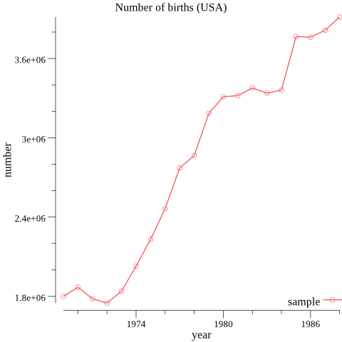

# 目的

golang で BigQuery API を利用してみます。
さらに、そのプログラムを digdag + docker  で動作させます。

## この記事で伝えたい事

* docker の image は alpine を使うとサイズを小さくできる。

* golang コードを cross compile した結果をつかうなら、 docker の image に golang 環境のインストールは不要。

* digdag + docker でプログラムを実行させるなら、 実行するプログラムの変更の度に docker image をつくりなおす必要は無い。


# ためした環境

- Mac OS X 10.11.6
- go 1.7.1 darwin/amd64
- docker version 1.12.0
- docker-machine version 0.8.0
- digdag version 0.8.17
- java version "1.8.0_101"

# 準備

* Googleサービスを使う準備が必要です。
[http://www.task-notes.com/entry/20151019/1445223600](http://www.task-notes.com/entry/20151019/1445223600) の
"サービスアカウントを使った認証" の章などを参照して、サービスアカウントでの認証のためのファイルを download しておきます。
(ファイル名は client.json とします)


* brew をつかって go をインストールします。
```
$ brew install go
```

* docker-machine をインストールします。
[docker-machine を使って boot2docker から脱却する](http://qiita.com/voluntas/items/7bcc9402b51a2ba99096) などを参照して
docker-machine をインストールします。

作業：
　次のように徐々に動作確認して、組み上げていきました。

　　1．golang で hello world プログラムを go run で実行する。 mac 用に compile して実行する。

　　2. docker + digdag で golang での hello world プログラムを cross compile したものを実行させる。

　　3．golang で BigQuery に query を発行し、グラフを生成するプログラムを go run で実行する。 mac 用に compile して実行する。

　　4. 上のことを組み合わせて、 docker + digdag で BigQuery にquery を発行し、グラフを生成させる。

# 作業1

```
$ cd golang
$ go run hello.go
Hello world from go-lang.
こんにちは. こちらは GO 言語です。
amd64 darwin
```
macos の 64 ビット環境で動作していることがわかります。

golang コードを compile して、実行してみます。

./makebin.sh を実行すると、各種の 実行ファイルが bin 以下に作成されるようにしてあります。

```
$ ./makebin.sh hello

$ tree bin
bin
├── darwin386
│   └── hello
├── darwin64
│   └── hello
├── linux386
│   └── hello
├── linux64
│   └── hello
├── windows386
│   └── hello.exe
└── windows64
    └── hello.exe

$ file bin/darwin386/hello
bin/darwin386/hello: Mach-O executable i386

$ bin/darwin386/hello
Hello world from go-lang.
こんにちは. こちらは GO 言語です。
386 darwin

$ file bin/darwin64/hello
bin/darwin64/hello: Mach-O 64-bit executable x86_64
$ bin/darwin64/hello
Hello world from go-lang.
こんにちは. こちらは GO 言語です。
amd64 darwin
```

MacOS 用の 32 bit, 64 bit の実行可能ファイルの作成、実行ができています。

```
$ file bin/linux64/hello
bin/linux64/hello: ELF 64-bit LSB executable, x86-64, version 1 (SYSV), statically linked, not stripped
```
linux 用の実行ファイルもできています。
次の作業では、このファイルの実行をしてみます。

# 作業2

まずは、docker image を作成します。(image ファイルのサイズ比較用に ubuntu と alpine 系のものを作成する)
```
$ cd linux
$ docker build -t ubuntu:14.04 .
$ docker build -f Dockerfile-alpine -t alpine .
$ docker build -f Dockerfile-alpine-golang -t alpine .
```

サイズを調べてみます。
```
$ docker images
ubuntu                    14.04               882e47f2a24b        8 minutes ago       205.2 MB
alpine                    latest              5e9901028327        10 minutes ago      20.39 MB
douglarek/alpine-golang   latest              12935fb44f16        2 weeks ago         6.695 MB
```

alpine系 のものは ubuntu の 1/10 以下のサイズであることがわかります。

それぞれの image でワークフローを実行できることを確認します。

作業１で、 linux 用の実行ファイルがすでに作成済みのはずです。それを ./bin/hello として copy しておきます。

* ubuntu の docker イメージで corss compaile したプログラムを実行してみます。

```
$ digdag run sample-01.dig -g hello
 ... 省略 ...
 Hello world from go-lang.
こんにちは. こちらは GO 言語です。
amd64 linux
```

* alpine の docker イメージで corss compaile したプログラムを実行してみます。
```
$ digdag run sample-01-alpine.dig -g hello
Hello world from go-lang.
こんにちは. こちらは GO 言語です。
amd64 linux

$ digdag run sample-01-alpine-golang.dig -g hello
Hello world from go-lang.
こんにちは. こちらは GO 言語です。
amd64 linux
```

つぎは、golang で BigQuery にアクセスするプログラムを作ってみます。

# 作業3

golang で BigQuery の piublicdata の出生数のデータに query を出して年度毎の出生数を得し、
そのデータを折れ線グラフにした png を生成する処理を golang で作成します。
(clinet.data を bigquery フォルダに copy しておく必要があります)

```
$ cd bigquery
$ go run graph.go
$ opne graph.png
```

graph.go を走らせると graph.png が生成されます。open で画像を表示させて確認できます。


次の作業の為に, cross compile をしておきます。
```
$ ./makebin.sh graph

$ tree bin
bin
├── darwin64
│   └── graph
└── linux64
    └── graph
```

# 作業4

作業3 で作成したプログラムを digdag + docker で実行してみます。

(client.json を このファイルがあるフォルダに copy して置くことと、
cp ../bigquery/bin/linux64/graph ./graph としてコンパイル結果のファイルを copy して置くことが必要です。)

```
$ cd all-together

# ubuntu の docker imaage で実行する。
$ digdag run sample-01.dig -s graph

# alpine-golang の docker image で実行する。
$ digdag run sample-01-alpine-golang.dig -s graph
```

ubuntu と alpine-golang では動作しましたが、 alpine ではうまく動作しません。
```
# alpine の docker image で実行する。
$ digdag run sample-01-alpine.dig -s graph
2016/10/20 18:41:05 Post https://www.googleapis.com/bigquery/v2/projects/sample-1385/queries?alt=json: oauth2: cannot fetch token: Post https://accounts.google.com/o/oauth2/token: x509: failed to load system roots and no roots provided
2016-10-21 03:48:57 +0900 [ERROR] (0017@+sample-01-alpine+graph): Task failed with unexpected error: Command failed with code 1
java.lang.RuntimeException: Command failed with code 1
	at io.digdag.standards.operator.ShOperatorFactory$ShOperator.runTask(ShOperatorFactory.java:193)
	at io.digdag.util.BaseOperator.run(BaseOperator.java:51)
	at io.digdag.core.agent.OperatorManager.callExecutor(OperatorManager.java:300)
	at io.digdag.cli.Run$OperatorManagerWithSkip.callExecutor(Run.java:678)
	at io.digdag.core.agent.OperatorManager.runWithWorkspace(OperatorManager.java:244)
	at io.digdag.core.agent.OperatorManager.lambda$runWithHeartbeat$2(OperatorManager.java:138)
	at io.digdag.core.agent.LocalWorkspaceManager.withExtractedArchive(LocalWorkspaceManager.java:25)
	at io.digdag.core.agent.OperatorManager.runWithHeartbeat(OperatorManager.java:136)
	at io.digdag.core.agent.OperatorManager.run(OperatorManager.java:120)
	at io.digdag.cli.Run$OperatorManagerWithSkip.run(Run.java:660)
	at io.digdag.core.agent.MultiThreadAgent.lambda$run$0(MultiThreadAgent.java:95)
	at java.util.concurrent.Executors$RunnableAdapter.call(Executors.java:511)
	at java.util.concurrent.FutureTask.run(FutureTask.java:266)
	at java.util.concurrent.ThreadPoolExecutor.runWorker(ThreadPoolExecutor.java:1142)
	at java.util.concurrent.ThreadPoolExecutor$Worker.run(ThreadPoolExecutor.java:617)
	at java.lang.Thread.run(Thread.java:745)
2016-10-21 03:48:57 +0900 [INFO] (0017@+sample-01-alpine^failure-alert): type: notify
error:
  * +sample-01-alpine+graph:
    Command failed with code 1

Task state is saved at /Users/katoy/github/golang-docker-digdag/all-together/.digdag/status/20161019T000000+0000 directory.
  * Use --session <daily | hourly | "yyyy-MM-dd[ HH:mm:ss]"> to not reuse the last session time.
  * Use --rerun, --start +NAME, or --goal +NAME argument to rerun skipped tasks.
```
グラフィック系のライブラリーが不足しているのが原因とおもいます。

Dokerfile のなかで、適切な package を追加することで解決できるとおもわれます。

でも、ここではそこまでせず、alpine-golang で動作したので良しとします。

参考：
- http://blog.techium.jp/entry/2016/06/27/090000 ワークフローエンジンDigDagでDockerを使ってみる

- http://qiita.com/asakaguchi/items/484ba262965ef3823f61 Alpine Linux で Docker イメージを劇的に小さくする

- http://qiita.com/pottava/items/970d7b5cda565b995fe7 Alpine Linux で軽量な Docker イメージを作る

- http://d.hatena.ne.jp/taknb2nch/20140609/1402292641 Go言語でプログラムを実行中のアーキテクチャとOSを取得する。

- https://speakerdeck.com/stormcat24/oqian-falsedockerimezihamadazhong-i?slide=20 お前のDockerイメージはまだ重い

- https://cloud.google.com/bigquery/query-reference?hl=ja      BigQuery クエリ リファレンス ROLLUP 関数にある query サンプル

- http://takedajs.hatenablog.jp/entry/2016/04/03/094529    golangで折れ線グラフを作る

- https://github.com/gonum/plot It provides an API for building and drawing plots in Go.
